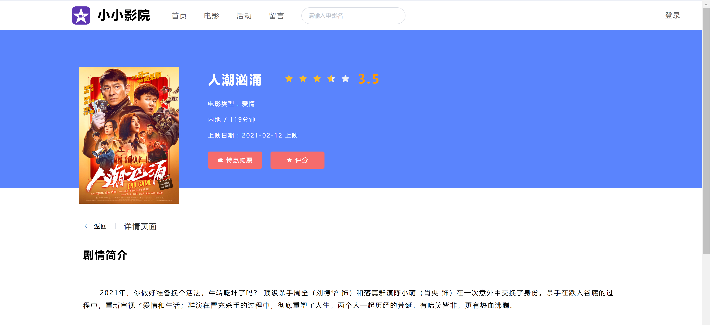
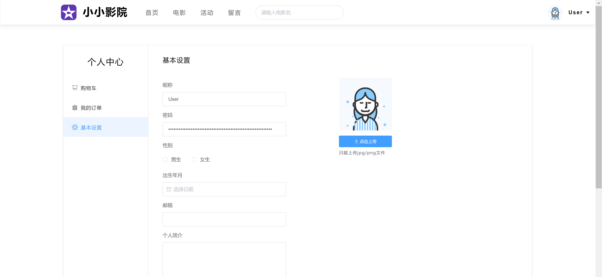
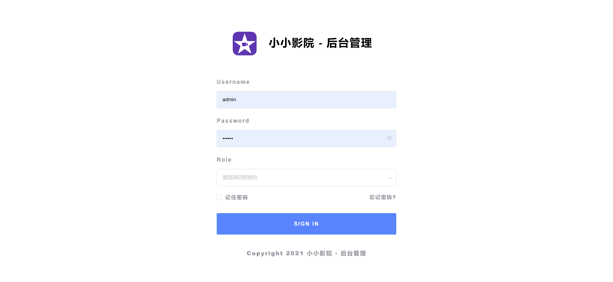
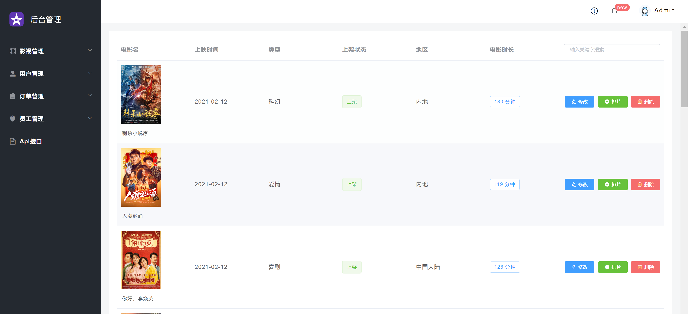
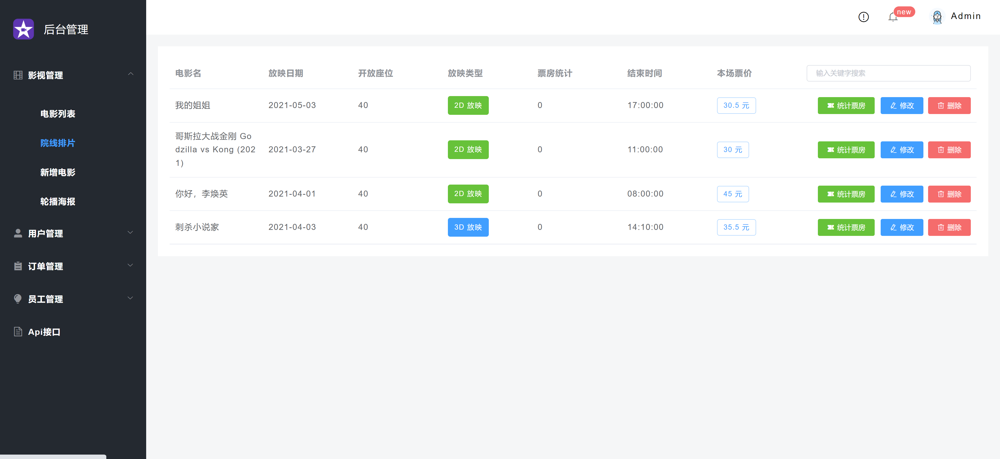
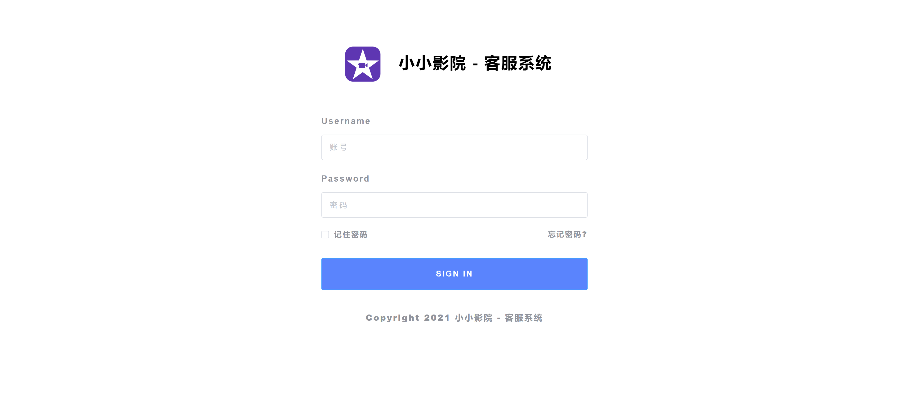
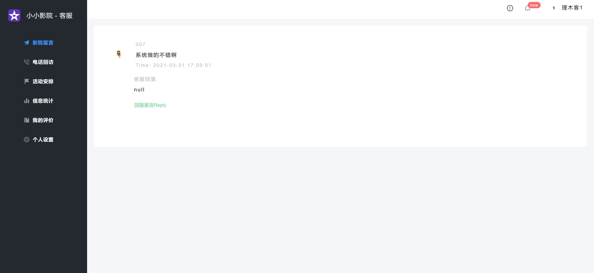

<h1 align="center">影院电影管理系统</h1>

## 简介
影院电影管理系统：支持管理员和用户角色，功能包括登录认证、电影管理、订单管理、用户反馈、个人中心等，旨在提升影院服务质量与用户体验。    --计算机毕业设计源码；毕设源码；java毕业设计源码

## 联系方式

<h3 align="center">获取完整代码与数据库文件 + 微信：deepguan QQ: 86050149 QQ群: 783742310</h3>

<h3 align="center">可帮忙远程部署 包运行成功！提供远程部署、修改代码、设计文档指导、代码讲解等服务！</h3>

## 功能介绍（完整见运行截图）
管理员：登录系统后可以通过主导航栏访问影院留言、电话回访、活动安排、信息统计和客服系统，与此同时，可管理电影排片，包括添加新电影、修改电影信息、统计票房等，同时拥有管理用户、订单、员工和API接口的权限，有效优化影院资源与客户服务。用户：用户可通过首页导航查询当前热播与热门榜单影片，使用搜索功能便捷检索电影，并在个人中心更改昵称、密码和其他个人信息，管理购物车和订单，进行影片评分与购票等操作，借助简洁的界面设计快速与系统交互。

## 运行截图

本代码来源于网络,仅供学习参考使用!

